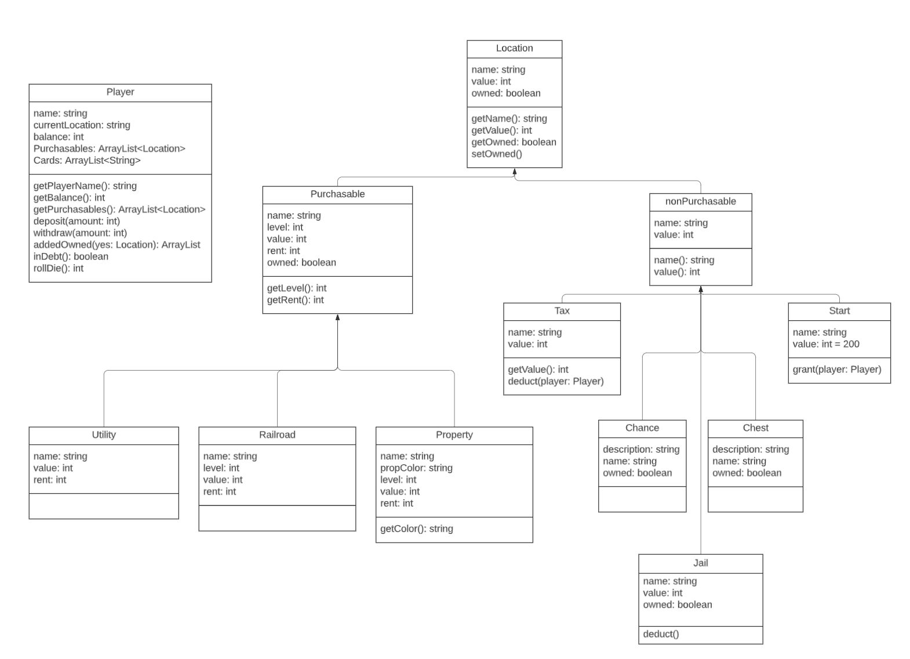

# APCS Final Project
THIS DOCUMENT IS REQUIRED
## Group Info
Group Name: WEN no PUN was intended
Members: Calvin Pun, Hui Wen Weng
## Overview
The final project of our team will be based on Monopoly. We aim to recreate a slightly simplified version of the Monopoly game in Processing using Java. The game may be played by two players. The goal of the game is to emerge as the player with the most net worth, calculated based on each player's cash balance and their property worth; once a player has less than or equal to $0 in their balance, the game automatically terminates and the program will calculate each player's assets to determine the winner. An "End Game" option is also available for an early termination of the game; a winner will be determined regardless of whether the "End Game" option was used or not. The game will be playable on a single device; the program will be able to cycle through players. Upon a “Roll Die” the two dice will roll and the current will be moved automatically, after which the player will be presented with options, such as "Buy," "Pay Fine," and "Use Jail Card," on the screen based on the location that the player lands on. Players must indicate the end of their turn using the "End Turn" option.
## Instructions
Note: Before playing, please install the sound files by going to Sketch > Import Library > Manage Libraries > in the search bar "Sound" > install "Sound" by The Processing Foundation
### Opening the Game
1. Open the file folder in Processing and click the "Run" button
2. You will be greeted with a starting screen, press "Start" to enter the game and view the game board
3. Decide on who's player 1 and who's player 2; player 1 will always begin the game
### Playing the Game
1. Player information are presented on the top right half of the window, and player commands/options are presented on the bottom right half of the window
2. Click on "Roll Die" to move your token
3. If you landed on a purchasable location, you will be present with a "Buy" option; the value of the location will be automatically withdrawn from your balance once you click on the option
4. If you landed on a card (Chance or Community Chest), you will see the card information displayed on the right, and the actions of the card will be automated
5. If you landed on "Go To Jail," you will automatically be sent to jail, and you will subsequently be provided with the options of rolling a double, paying a fine, or using a Get Out of Jail card (if you have one) to get out of jail
7. Click on "End Turn" to switch the turn to the next player 
### Ending the Game
* You have the option to terminate the game early by clicking the "End Game" option on the upper right hand corner of the window
* If any player's balance falls below 0, the game will automatically end
* Regardless of whether the "End Game" option was chosen, the end screen will display the winner of the game based on the calculated net worth (balance + property worth) of each player
* Press "Menu" to start another game
## Updated Prototype
### Brief Project Description
The final project of our team will be based on Monopoly. We aim to recreate a slightly simplified version of the Monopoly game in Processing using Java. The game may be played by two players. The goal of the game is to emerge as the player with the most net worth, calculated based on each player's cash balance and their property worth; once a player has less than or equal to $0 in their balance, the game automatically terminates and the program will calculate each player's assets to determine the winner. An "End Game" option is also available for an early termination of the game; a winner will be determined regardless of whether the "End Game" option was used or not. The game will be playable on a single device; the program will be able to cycle through players. Upon a “Roll Die” the two dice will roll and the current will be moved automatically, after which the player will be presented with options, such as "Buy," "Pay Fine," and "Use Jail Card," on the screen based on the location that the player lands on. Players must indicate the end of their turn using the "End Turn" option.
### Expanded Description
The critical features of this project includes but are not limited to the game board setup, playing commands, players, and locations. The game board set up will be done in the main sketch of the program. The game board itself will be created based on an image uploaded to Processing. The game board will have several attributes, including a string array of Community Chest cards, a string array of Chance cards, a Locations array of all locations on the game board, starting from the Start to the end going in a clockwise direction, and a Player array of all the players in the game. The Locations of the board will be a broad class that will have two children classes that categorizes the locations into purchasable and non-purchasable, each with children classes of different types of locations on the game board: properties, utilities, railroads, jail, tax, start, card, whose child classes are chance and chest. Each instance of Locations and its child will have attributes that describe the value, rent, prices for leveling the location up (if applicable), property set color, and the name of the current owner. There will be methods that return each of these attributes. Two additional methods will set the name of the new owner of the current location and calculate the new rent based on the possession of the complete color set (to be used in rent).The Player class will have attributes of player name, a default balance of $1500, current location, a Locations array of the locations that they own, and a string array of all the cards they may have gathered from landing on Chest or Chance locations. Playing commands will be provided in the visual forms of buttons in the main sketch (in the draw method). These commands will include one that moves the player, those that deposit and withdraw money from the player’s balance, one that checks for debt, one that buys locations. one that allows the player to pay a fine, use a card, or roll a double to get out of jail (when applicable), and one that allows the player to terminate their turn when they are done with all their commands. Players are also able to purchase a Purchasable location when applicable, and the corresponding command, in the form of a button, will appear then. Finally, some basic characteristics of the game include a start screen, from which the player could press "Start" and view the game board, an end screen that will display the winner of the game based on the calculated net worth of each player and a "Menu" button that allows the players to start a new game, and music for each stage of the game.
### UML Diagrams

### Development Phases
#### Phase I: Building Major Classes and Methods
1. Players Class (Calvin)
2. Locations Class (Hui Wen)
3. Card Class (Calvin)
#### Phase II: Building Child Classes and Methods
1. Purchasable Abstract Child Class (Calvin)
2. Utility Child Class (Hui Wen)
3. Railroad Child Class (Hui Wen)
4. Property Child Class (Hui Wen)
5. Non-Purchasable Child Class (Hui Wen)
6. Tax Child Class (Hui Wen)
7. Jail Child Class (Hui Wen)
8. Start Child Class (Calvin)
9. Chance Child Class (Hui Wen)
10. Chest Child Class (Hui Wen)
#### Phase III: Building the Game Board
1. Game board image import (Calvin)
2. Player movement (Calvin)
3. Display player information (Calvin)
4. Player options (buttons) — Start, Buy, Roll Die, End Game, End Turn, Menu, etc. (Calvin)
5. Start screen (Hui Wen)
6. End/loss screen (Hui Wen)
7. Card display + automated actions (Hui Wen)
8. Music (Calvin)
## Development Log
### Working features
* Feature one
* Feature two
### Broken Features/Bugs
* Feature one
* Feature two
### Helpful Resources
* Resource one
* Resource two
